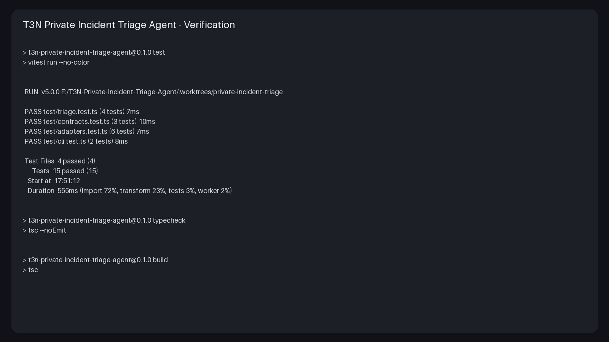
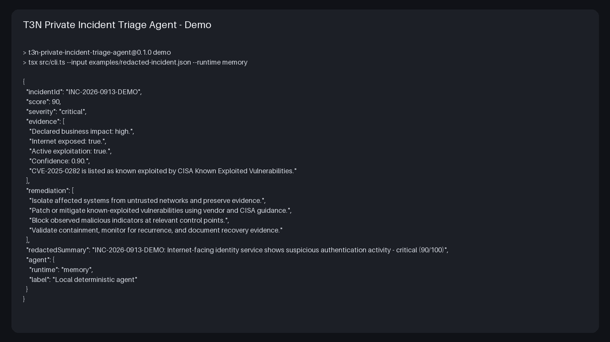

# Submission Evidence

## Verification



The verification image is rendered from `submission/verification-output.txt`, captured from the project worktree after a clean test/typecheck/build run. It shows 4 test files and 15 tests passing, followed by successful TypeScript typecheck and build commands.

## Demo



The demo image is rendered from `submission/demo-output.txt`. It shows the synthetic incident workflow returning a deterministic critical score of 90/100 and CISA KEV evidence for CVE-2025-0282.

## Reproduction

```bash
npm ci
npm test
npm run typecheck
npm run build
npm run demo
```

No production incident data, private key, T3N API key, or wallet secret is included in the evidence.
